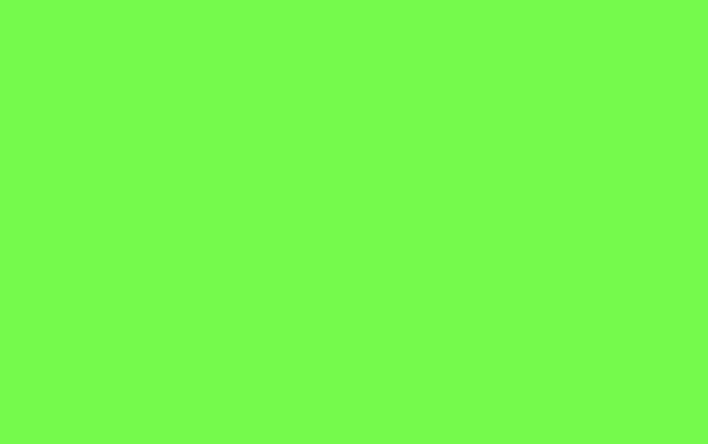
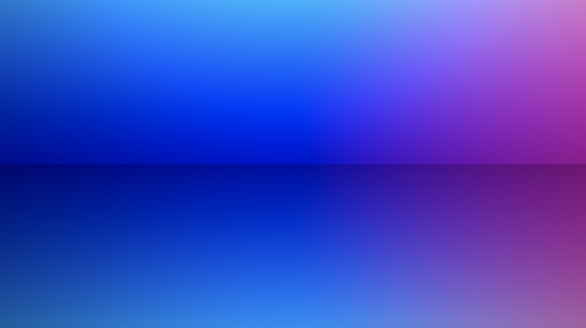
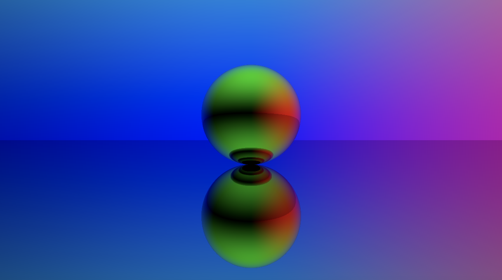
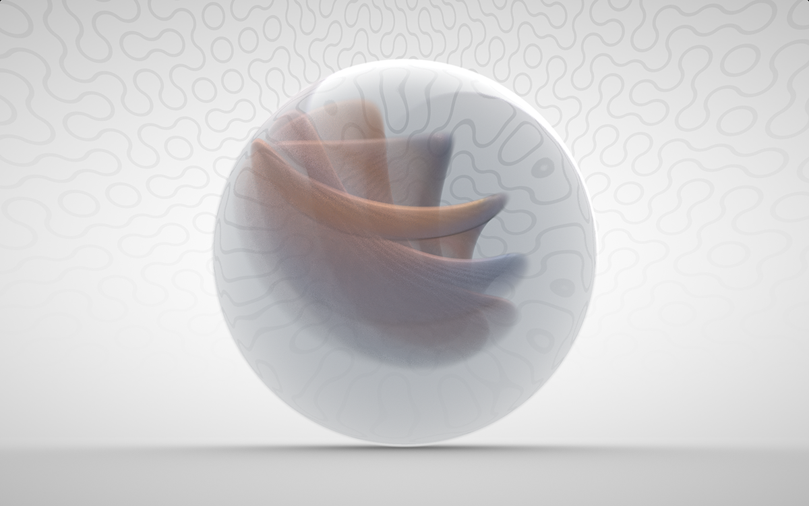
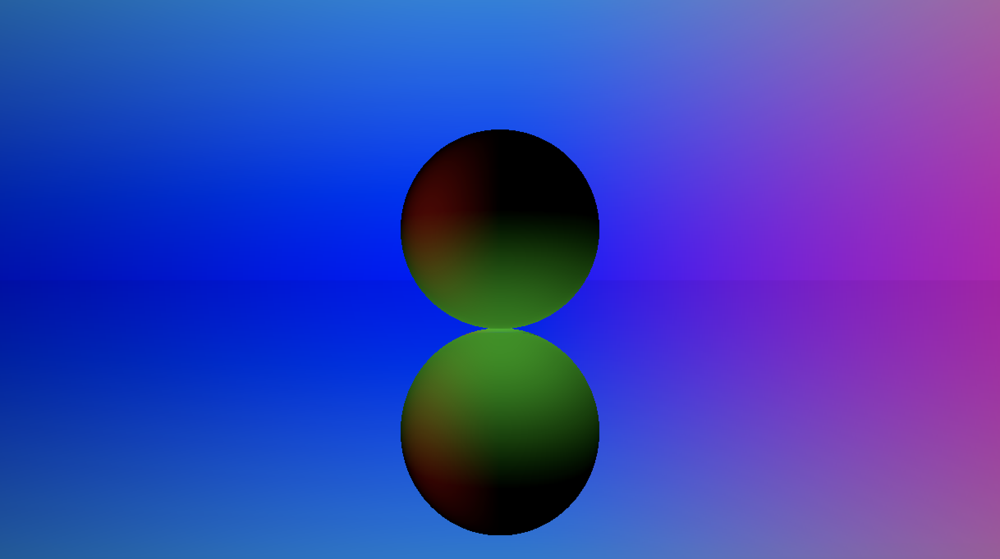
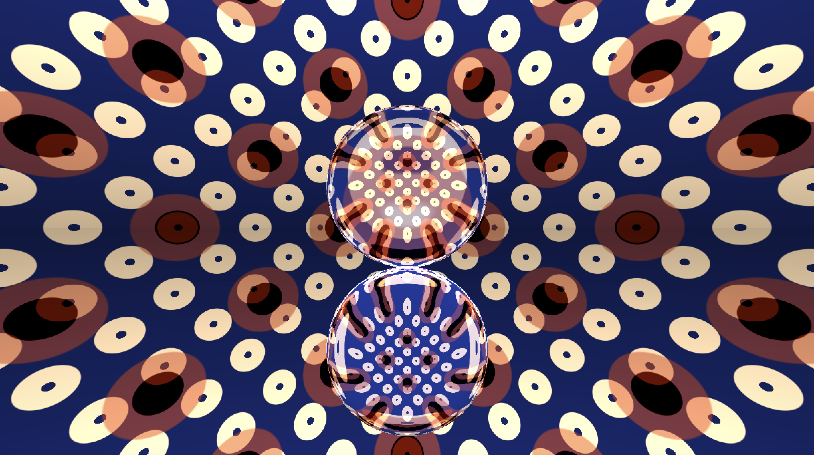

## Let's Create a Marble Shader in Unity!

Back sometime, when I wandered in the cyber space I found a post about [creating intricate ice in Unity](https://80.lv/articles/building-intricate-ice-shaders/), and I immediately fell in love with the visual patterns. There is an incredibly beautiful image for you to have a feel:


However when I bought the asset to see how it works, I was slightly unsatisfied because most of the patterns are baked in textures. The ices are not actually usable for arbitrary objects except for plane. And they are not transparent. I clearly want a toy with similar breath but has the following traits:

1. it can reflect lights
2. it can refract other objects through it
3. it has to be transparent (by axiom 2, right?)

And after some research, I had this as my result - which is also the same you will have after the tutorial:


### What do I need to know in advance?

I assume you should be familiar with programming with Unity, that's all. _:)_

I will explain everything you need to know in the tutorial and you will see it is so easy, in fact, to create the visual effects and the only boundary to use the rest is your imagination.

If you are more than curious with the content, here's a list of quickie keywords:

* **ray tracing**
* **compute shader**
* **fresnel effect**

Don't be afraid of the terms if you don't know about them! They are really, really simple to understand. And in fact you don't need to understand everything about them.

### Cut the craps...Let's get started!

There is a premade Unity package to get you start. **[Download it here](./assets/marble-shader-starter.unitypackage).**

---

### Now it Renders...

If you haven't downloaded the Unity package, you must didn't read my tutorial carefully enough. :( Don't worry! I do that sometimes, too! The link is above, with text bolded, go download it, and open it in Unity. I reminded you again because, I love you.

Now, the project is setup pretty simple and should get you started. We have a scene with a camera, a C# script named `RayTrace.cs` attached to the camera, and a compute shader named `RayTrace.compute` attached to the C# script. If you click on "Play" button you should be able to see it does work - a pattern is rendered from compute shader to screen.

The C# script does one thing: it links the compute shader to Unity `MonoBehaviour` lifecycle and sends the output to screen. And the compute shader generates a pattern. Later we will send some data from Unity to shader and get it back, the data will be _computed_ and returned and that's why we call the shader as a compute API because it does more than graphics rendering!

> **Tip 0**. Go on, click "Play" and see what happens :)

> **Tip 1**. In case you are very interested in compute shader I have also made a procgen grass shader, the wind swing movement of grass mesh vertices is computed inside shader and sent back to Unity. It's open sourced! I released it on [GitHub](https://github.com/KHN190/UnityGrassShader).


_* Above is the result of my grass shader, all vertex movement is computed using a compute shader._

Let's read some code:

```cs
// RayTrace.cs
public class RayTrace : MonoBehaviour
{
    private RenderTexture target;
    public ComputeShader shader;

    private void OnRenderImage(RenderTexture source, RenderTexture destination)
    {
    	// Initiate Screen target, and dispatch compute shader
        Render(destination);
    }
}
```

The `target` is our output, screen. The `shader` is where output pixels are calculated. The `Render` function is our entry to shader initialization, which does a few more things:

```cs
// RayTrace.cs
private void Render(RenderTexture destination)
{
    // Make sure we have a current render target
    InitRenderTexture();

    // Set the target and dispatch the compute shader
    shader.SetTexture(0, "Result", target);
    int threadGroupsX = Mathf.CeilToInt(Screen.width / 8.0f);
    int threadGroupsY = Mathf.CeilToInt(Screen.height / 8.0f);
    shader.Dispatch(0, threadGroupsX, threadGroupsY, 1);

    // Blit the result texture to the screen
    Graphics.Blit(target, destination);
}

private void InitRenderTexture()
{
    if (target == null || target.width != Screen.width || target.height != Screen.height)
    {
        RenderTexture init = new RenderTexture(Screen.width, Screen.height, 0,
            RenderTextureFormat.ARGBFloat, RenderTextureReadWrite.Linear);
        init.enableRandomWrite = true;
        init.Create();

        if (target != null)
            target.Release();
        target = init;
    }
}
```

The line `shader.Dispatch` starts our shader, and `Graphics.Blit` gets its output to screen. We will leave them like it is once we setup, and now it should work. So we can move to the shader:

```c
#pragma kernel CSMain

RWTexture2D<float4> Result;

// CSMain stands for "Compute Shader Main Program" but the name is arbitrary
[numthreads(8,8,1)]
void CSMain (uint3 id : SV_DispatchThreadID)
{
    Result[id.xy] = float4(id.x & id.y, (id.x & 15)/15.0, (id.y & 15)/15.0, 0.0);
}
```

Each compute shader has a main program, in this case, it is `CSMain`. The `numthreads` defines the way you use GPU cores, for more advanced fine-tuning purposes. In this tutorial use the number here is fine.

Adn we have the variable of our screen data defined in `RWTexture2D<float4> Result`. That's how the last line `Result[id.xy] = color` is possible to change our screen. If you want to ever change the last line to see how it works, feel free to do it so! e.g. change it to:

```c
Result[id.xy] = float4(0.0, 1.0, 0.0, 0.0); // green
```

See? Do you have any idea why it is `float4` now? Because it stands for 4 channels of colors: red, green, blue, and alpha (RGBA). And that is how shaders work, really. We are assiging colors to each pixel on `id.xy`, and we blend colors to get what we desire. Each pixel is binded to its position on screen, so we will also do a little magic using some math. :)

---

### My Camera Can Shoot a Ray!

OK. What now? For a [demo scene](https://en.wikipedia.org/wiki/Demoscene) the first thing I want is a plane which can accept lights and shadows. The second part is the background skybox. And the rest is our "real" marble shader on a sphere.

And we are going to test the colors on each pixel, the test is made possible with a ray shot from our main camera, and the ray tells me the closest object to camera on that pixel so we can decide the color accordingly.

> Since we are going to only have a plane, a skybox, and a sphere, the test is dead simple - we will be testing intersection with all objects, seeing if anything is the closest.

The [ray](https://en.wikipedia.org/wiki/Ray_tracing_(graphics)) is also physically simulated, similar to what light in nature will do - I mean simulated, not exactly the same. After all, we are building graphics and sometimes it is necessary to bend the physical rules for better looking / performance. The reason we are doing it using ray tracing is it gives a photorealistic looking and it is intuitive in this case - we want refraction, right? Then simulate the real physical process.

In the compute shader add the following code to the head, before `CSMain`:

```c
struct Ray
{
    float3 origin;
    float3 direction;
    float3 energy;
};

struct RayHit
{
    float3 position;
    float distance;
    float3 normal;
    uint object;
};
```

And we have the function to create a ray and the hit info, add them after the structs definition, but before `CSMain`:

```c
Ray CreateRay(float3 origin, float3 direction)
{
    Ray ray;
    ray.origin = origin;
    ray.direction = direction;
    ray.energy = float3(1.0f, 1.0f, 1.0f);
    return ray;
}

RayHit CreateRayHit()
{
    RayHit hit;
    hit.position = float3(0.0f, 0.0f, 0.0f);
    hit.distance = 1.#INF;
    hit.normal = float3(0.0f, 0.0f, 0.0f);
    hit.object = 0;
    return hit;
}
```

Everything here is self explanatory, only the `unit object` is reserved for tagging the objects - I want to tell if it is hit on a plane, skybox, or a sphere. By default, it is `0` - denotes the skybox.

Now the only problem left for this section is, how do we create a ray from camera? Since we are going to use Unity's camera, we need to transfer that information from Unity to GPU. So in the compute shader, we define it:

```c
// after the line `#pragma kernel Main`

// Input
float4x4 _CameraToWorld;
float4x4 _CameraInverseProjection;

// Output
RWTexture2D<float4> Result;
```

And after the `CreateRayHit` function we can project everything to camera space:

```c
Ray CreateCameraRay(float2 uv, float4x4 camToWorld, float4x4 camInvProj)
{
    // Transform the camera origin to world space
    float3 origin = mul(camToWorld, float4(0.0f, 0.0f, 0.0f, 1.0f)).xyz;
    // Invert the perspective projection of the view-space position
    float3 direction = mul(camInvProj, float4(uv, 0.0f, 1.0f)).xyz;
    // Transform the direction from camera to world space
    direction = normalize(mul(camToWorld, float4(direction, 0.0f)).xyz);

    return CreateRay(origin, direction);
}
```

In the `CSMain` we can create the ray for each pixel then:

```c
[numthreads(8,8,1)]
void CSMain (uint3 id : SV_DispatchThreadID)
{
    // Get the dimensions of the RenderTexture
    uint width, height;
    Result.GetDimensions(width, height);
    // Transform pixel to [-1,1] range
    float2 uv = float2((id.xy + 0.5) / float2(width, height) * 2.0f - 1.0f);
    // Create a ray
    Ray ray = CreateCameraRay(uv, _CameraToWorld, _CameraInverseProjection);

    float3 color = ray.origin;
    Result[id.xy] = float4(color.r, color.g, color.b, 1.0);
}
```

The camera settings are predefined in Unity, thanks :)

```cs
// after shader.SetTexture(0, "Result", target);
shader.SetMatrix("_CameraToWorld", Camera.main.cameraToWorldMatrix);
shader.SetMatrix("_CameraInverseProjection", Camera.main.projectionMatrix.inverse);
```

Finally, if we want to verify everything works, click "Play"! But before that, think for a while, what you will be seeing? Remember, the line that defines our pixel is `float3 color = ray.origin;` if you haven't noticed, is it the same result as you expected? Why? ;)

> Try drag the camera in Unity Editor along XYZ axis, now what happens??

---

### The Ray Shall be Traced



_The ray's origin is transformed to RGB on each pixel, the color varies when camera moves._

For now...we have successfully created a ray for each pixel, but we don't test any object for the rays, so we don't know what exactly should be output to the pixel yet. We are doing it now.

Add the lines after `CreateCameraRay` but before `CSMain`:

```c
// trace a ray
RayHit Trace(Ray ray)
{
    RayHit bestHit = CreateRayHit();
    // intersect with plane
    IntersectGroundPlane(ray, bestHit);
    return bestHit;
}

// output color
float4 Shade(inout Ray ray, RayHit hit)
{
    if (hit.object > 0)
    {
        // hit ground
        if (hit.object == (uint)1)
            return Reflective(ray, hit);
    }
    // If hit nothing
    return Background(ray.direction);
}
```

We have introduced 3 new functions:

* `IntersectGroundPlane` which tests if the ray from camera hits a plane
* `Reflective` which defines how a light looks like on a metal-like surface
* `Background` which defines how the skybox looks like

And because for shaders you can only use a function after you define it, we need some new definitions. The descriptive function for plane intersection is simple, we use object number `1` for plane:

```c
void IntersectGroundPlane(Ray ray, inout RayHit bestHit)
{
    // Calculate distance along the ray where the ground plane is intersected
    float t = -ray.origin.y / ray.direction.y;
    if (t > 0 && t < bestHit.distance)
    {
        bestHit.distance = t;
        bestHit.position = ray.origin + t * ray.direction;
        bestHit.normal = float3(0.0, 1.0, 0.0);
        bestHit.object = 1;
    }
}
```

> It is totally possible to create other objects like this! Like, torus. [Shadertoy.com](https://www.shadertoy.com/view/tltGzj) has many interesting examples and you should definetely have a look.

We also need other two for metal-like materials and for skybox:

```c
float4 Reflective(inout Ray ray, RayHit hit)
{
    // slightly step aside from the origin 
    // so it doesn't get recalculated at the same position
    ray.origin = hit.position + hit.normal * 0.001;
    // ray is reflected and direction changes
    ray.direction = normalize(reflect(ray.direction, hit.normal));
    // energy decay after reflection
    ray.energy =  ray.energy * 0.8;

    return float4(0.0, 0.0, 0.0, 1.0);
}

float4 Background(float3 vec)
{
    //return float4(0.5, 0.5, 0.5, 1.0);
    return float4(vec.x, vec.y, vec.z, 1.0);
}
```

And we need to change `CSMain` to output our desired colors. Delete the lines about colors, replace them with:

```c
// in CSMain, after Ray ray = CreateCameraRay(...)

// by default it is dark black
float4 color = float4(0.0, 0.0, 0.0, 1.0);
// Bounce 8 times
for (uint i = 0; i < 8; i++)
{
    RayHit hit = Trace(ray);
    float4 output = Shade(ray, hit);
    // hit on object, so color is changed
    color.rgb += ray.energy * output.rgb * output.a;
    color.a = output.a;

    // hit skybox
    if (hit.object == 0)
    {
    	// reset energy
        ray.energy = 0.0;
        // stop bouncing
        break;
    }
}
Result[id.xy] = color;
```

Click "Play"!



The line `ray.direction` is where "magic" lays. Since compute shader uses [HLSL](https://en.wikipedia.org/wiki/High-Level_Shading_Language) language, it provided us a very handy function `reflect` to calculate light reflection. Light direction is changed, and that's all to get physically simulated lights.

---

### Create a Sphere

Now we are creating the sphere in the center of our screen. Remeber how we test intersection with plane above? Sphere intersection is much similar. Define our new sphere data, and add lines after plane intersection function:

```c
// new struct, add after Ray and RayHit
struct Sphere
{
    float3 position;
    float radius;
};

// new intersection function
void IntersectSphere(Ray ray, inout RayHit bestHit, Sphere sphere)
{
    // Calculate distance along the ray where the sphere is intersected
    float3 d = ray.origin - sphere.position;
    float p1 = -dot(ray.direction, d);
    float p2sqr = p1 * p1 - dot(d, d) + sphere.radius * sphere.radius;
    if (p2sqr < 0)
        return;
    float p2 = sqrt(p2sqr);
    float t = p1 - p2 > 0 ? p1 - p2 : p1 + p2;
    // find closest hit
    if (t > 0 && t < bestHit.distance)
    {
        bestHit.distance = t;
        bestHit.position = ray.origin + t * ray.direction;
        bestHit.normal = normalize(bestHit.position - sphere.position);
        bestHit.object = 2;
    }
}

// in void Shade(), we are gonna check the sphere as well
if (hit.object > 0)
{
    // hit ground
    if (hit.object == (uint)1)
        return Reflective(ray, hit);

    // hit sphere
    if (hit.object == (uint)2)
        return Reflective(ray, hit);
}
```

Now everything for sphere shading / intersection test is ready but we _don't have a sphere_ yet. It is, possible that to create spheres in Unity and pass the data to GPU, which is what I have done in the [final project](https://github.com/KHN190/the-biography). However, for simplicity let's create the sphere in shader by some hard coding.

> Data is able to be transfered to compute API using a buffer. Unity has a [complete doc](https://docs.unity3d.com/ScriptReference/ComputeBuffer.html) for it. If you want to see example, my final project for this tutorial is hosted on GitHub. See `RayTrace.cs`, the only tricky part is you need to tell GPU the length of data in bytes.

As to create and intersect a sphere, we can do it in `void Trace()`:

```c
// trace a ray
RayHit Trace(Ray ray)
{
    // create a sphere
    Sphere sphere;
    sphere.position = float3(0.0, 2.0, 0.0);
    sphere.radius = 2.0;

    RayHit bestHit = CreateRayHit();
    // intersect with plane
    IntersectGroundPlane(ray, bestHit);
    // intersect with sphere
    IntersectSphere(ray, bestHit, sphere);

    return bestHit;
}
```

Currently our sphere is the same as plane, reflective as metal, so if you click "Play", you'll see...



---

### Add Refraction to the Sphere

Remeber what we mentioned at the start of the tutorial? I want a sphere that

1. it can reflect lights
2. it can refract other objects through it
3. it has to be transparent (by axiom 2, right?)

Now we are half way of it! It indeed took me much time to figure out how to create refraction effects, where I read many shadertoy scripts, most of them are really...in a mess. I don't mean they don't have fabulous effects but have you ever tried understanding what is going on after all [these code](https://www.shadertoy.com/view/XsSGDh)? I tried. :/ Believe me, it's not for human.



So here, kindly, I have the code for you to create refraction! Well commented. Hey, because I love you.

```c
// add it after void Reflective(...) and void Background(...)
float4 Refractive(inout Ray ray, RayHit hit)
{
    // refraction rate of air
    float w = 1.0;
    // refraction rate of glass
    float f = 1.01;

    ray.origin = hit.position - hit.normal * 0.001;
    ray.direction = normalize(refract(ray.direction, hit.normal, w / f));
    ray.energy *= 0.95;

    ray.direction *= -1.0;
    ray.direction = normalize(refract(ray.direction, hit.normal, w / f * 0.85));
    ray.energy *= 0.95;

    return Background(ray.direction * 0.4);
}
```

Genuinely, I wouldn't pretend I truely understand why I need to do the refraction twice. But it just kinda...works. If anyone understands it, give me a comment or contact me through [Twitter](http://twitter.com/knh1901) ok? Every piece of refraction code calculates it twice. So I used it simply as a formula.

Now we can have reflection on Sphere as well:

```c
// void Shade()

// hit sphere
if (hit.object == (uint)2)
{
    float f = 0.8;
    return Refractive(ray, hit) * f + Reflective(ray, hit) * (1.0 - f);
}
```

You can adjust the proportion of refraction and reflection to see differences. Here's what I have:



### Argh, You are Not Beautiful...Yet

The code above changes the direction of light, and it maps the background into the marble sphere, but the colors are not very...beautiful. And we can actually change it :) You see how? The colors are generated using `void Background()` so we can add visually attractive patterns in that function and whola!

I searched pretty hard of generative patterns and found many creative works, but I decided to take the pattern from [book of shaders](https://thebookofshaders.com/09/). Here's the code I replaced my `Background` function and you are totally free to replace it with your own (I have tested quite a few and just felt this is the best looking one):

```c
// book of shader
float2 tile(float2 st, float zoom){
    st *= zoom;
    return frac(st);
}

float circle(float2 st, float radius){
    float2 pos = float2(0.5 - st);
    radius *= 0.75;
    return 1.-smoothstep(radius-(radius*0.05),radius+(radius*0.05),dot(pos,pos)*3.14);
}

float circlePattern(float2 st, float radius) {
    return  circle(st+float2(0.,-.5), radius)+
            circle(st+float2(0.,.5),  radius)+
            circle(st+float2(-.5,0.), radius)+
            circle(st+float2(.5,0.),  radius);
}

float4 Background(float3 vec)
{
    float2 st = float2(vec.x, vec.y);
    float2 nt = float2(vec.x, vec.y);
    float3 color = 0.0;

    float2 grid1 = tile(st,7.);
    grid1 = tile(st, 7.);
    color += lerp(float3(0.075,0.114,0.329),float3(0.973,0.843,0.675),circlePattern(grid1,0.23)-circlePattern(grid1,0.01));

    float2 grid2 = tile(st,3.);
    grid2 = tile(nt,3.);
    color += lerp(color, float3(0.761,0.247,0.102), circlePattern(grid2,0.2)) - circlePattern(grid2,0.05);

    return float4(color.x, color.y, color.z, 1.0);
}
```

And I added a line inside `CSMain` to desaturate the color a bit (avoid over exposure):

```c
if (hit.object == 0)
{
	// desaturate
	color.rgb *= lerp(0.4, 1.0, abs(ray.direction.y));
	ray.energy = 0.0;
	break;
}
```

Here is what I have :)



It immediately looks good! Right? I hope you feel the same.

---

### Animate Everything...!!!

Final step!!!! We are going to add time to every variable so the scene animates. The light will changes along time. Human eyes love moving objects, almost everything looks much better when they are animated. So we are gonna do it. OK? Go!

To pass time to GPU, we need to send it from Unity C#. Edit `RayTrace.cs` and add this line:

```cs
// inside void Render()
shader.SetFloat("_Time", Time.time);
```

And we need to define the variable in our shader:

```c
// RayTrace.compute
// add after camera variables
float _Time;
```

We are gonna animate background:

```c
float4 Background(float3 vec, float t)
{
    float2 st = float2(vec.x + t, vec.y);
    float2 nt = float2(vec.x + t * 0.5, vec.y);
    // ...
}
```

So we also need it in `Refractive`:

```c
float4 Refractive(inout Ray ray, RayHit hit, float t)
{
	// ...
	return Background(ray.direction * 0.4, t);
}
```

Pass the time to shader inside `Shade`:

```c
// output color
float4 Shade(inout Ray ray, RayHit hit)
{
    if (hit.object > 0)
    {
        // hit ground
        if (hit.object == (uint)1)
            return Reflective(ray, hit);

        // hit sphere
        if (hit.object == (uint)2)
        {
            return Refractive(ray, hit, _Time) * 0.8 + Reflective(ray, hit) * 0.2;
        }
    }
    // If hit nothing
    return Background(ray.direction, _Time);
}
```

Click "Play"!...You'll find the background animates too fast. It's easy to fix. Go to `RayTrace.cs`, add a multiplier to the time:

```cs
shader.SetFloat("_Time", Time.time * 0.2f);
```

"Play" again. Congrats! You now have the marble shader same as the start of the blog. Of course, I made a lot of trials during the creation to make it look good. There are hard coded variables which you can defintely adjust within Unity. Again, just as a reminder, the complete project is on [GitHub](https://github.com/KHN190/the-biography). Feel free to have a look!

And if you have any feedback or question, absolutely ask me on [Twitter](http://twitter.com/knh1901).

Have a nice lunar new year. Have good health. Sent from China.

[back](./)
